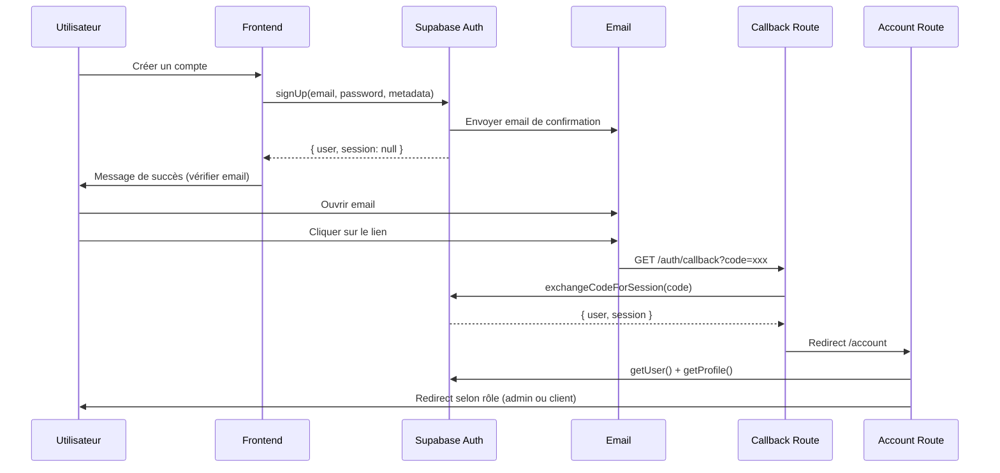

# 📧 Configuration de la Confirmation par Email

## ✅ Ce qui a été fait

Le code a été mis à jour pour gérer correctement la confirmation par email :

1. ✅ Message de succès après création de compte
2. ✅ Pas de connexion automatique (l'utilisateur doit confirmer son email)
3. ✅ Route callback `/auth/callback` pour gérer le retour
4. ✅ Redirection intelligente après confirmation (admin vs client)

---

## 🔧 Configuration Supabase Requise

### **Étape 1 : Activer la confirmation d'email**

1. Va dans **Supabase Dashboard**
2. **Authentication** > **Providers** > **Email**
3. Active **"Confirm email"** (Toggle ON)
4. Clique sur **Save**

### **Étape 2 : Configurer l'URL de redirection**

1. Toujours dans **Authentication** > **URL Configuration**
2. Ajoute cette URL dans **"Redirect URLs"** :
   ```
   http://localhost:3000/auth/callback
   ```

3. Pour la production, ajoute aussi :
   ```
   https://tondomaine.com/auth/callback
   ```

### **Étape 3 : Personnaliser l'email de confirmation (Optionnel)**

1. Va dans **Authentication** > **Email Templates**
2. Sélectionne **"Confirm signup"**
3. Personnalise le template si tu veux (garder {{ .ConfirmationURL }} est important)

---

## 🧪 Test du Flow Complet

### **1. Créer un compte**

1. Va sur http://localhost:3000/login
2. Clique sur **"Créer un compte"**
3. Remplis :
   - Nom : Test User
   - Email : **ton-vrai-email@gmail.com** (utilise un vrai email que tu peux checker)
   - Mot de passe : Test1234!
4. Clique sur **"Créer mon compte"**

**✅ Tu devrais voir :**
> ✅ Compte créé avec succès ! Un email de confirmation vous a été envoyé. Veuillez cliquer sur le lien dans l'email pour activer votre compte.

### **2. Confirmer l'email**

1. **Ouvre ta boîte mail**
2. Cherche l'email de Supabase (vérifie les spams si besoin)
3. **Clique sur le lien de confirmation**

**✅ Tu devrais être redirigé vers :**
- http://localhost:3000/account/profile (si client normal)
- http://localhost:3000/admin/dashboard (si admin)

### **3. Se connecter**

Après confirmation, tu peux te connecter normalement avec ton email et mot de passe.

---

## 🚨 Problèmes Courants

### **Problème 1 : Email non reçu**

**Causes possibles :**
- Email dans les spams
- Mauvaise config Supabase (vérifier Auth > Email)
- Rate limit Supabase (max 3 emails/heure en mode gratuit)

**Solution :**
- Vérifier les spams
- Attendre 1 heure si rate limit
- Vérifier dans Supabase Dashboard > Authentication > Users que l'utilisateur existe

### **Problème 2 : Lien de confirmation ne fonctionne pas**

**Cause :**
- L'URL de callback n'est pas dans les Redirect URLs autorisées

**Solution :**
1. Supabase Dashboard > Authentication > URL Configuration
2. Ajoute `http://localhost:3000/auth/callback`
3. Save

### **Problème 3 : Redirect URL mismatch**

**Erreur dans l'URL :**
```
?error=redirect_url_mismatch
```

**Solution :**
Ajoute toutes tes URLs dans les Redirect URLs :
- `http://localhost:3000/auth/callback`
- `http://localhost:3000/**` (wildcard pour dev)

---

## 📝 Flow Technique Complet



---

## ✅ Checklist de Validation

- [ ] Confirm email activé dans Supabase
- [ ] Redirect URL configurée (`http://localhost:3000/auth/callback`)
- [ ] Compte créé avec succès (message vert)
- [ ] Email reçu (vérifier spams)
- [ ] Lien de confirmation cliqué
- [ ] Redirection vers l'espace client réussie
- [ ] Connexion manuelle fonctionne après confirmation

---

## 🎯 Prochaine Étape

Une fois que la confirmation par email fonctionne, on pourra créer l'interface complète de l'espace client ! 🚀

