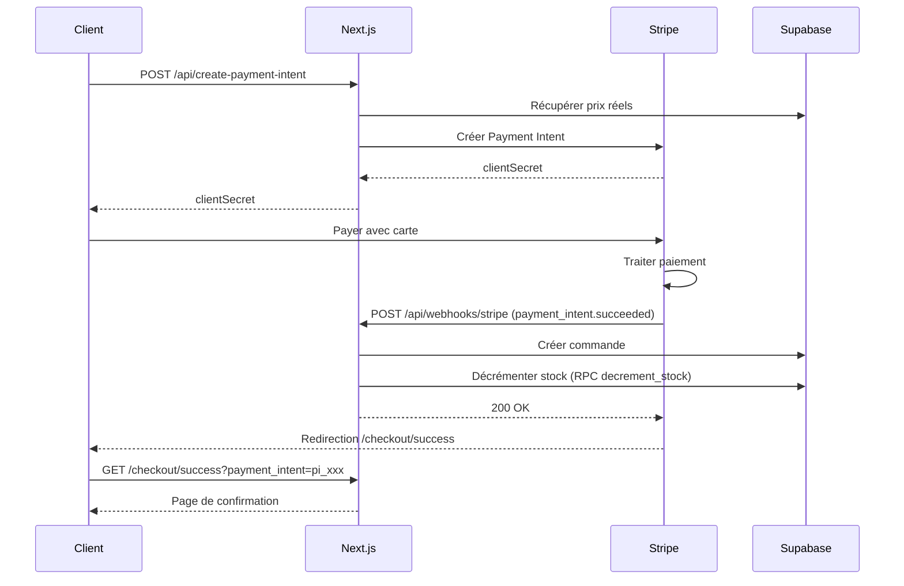

# 🎉 Système de Commandes et Webhook Stripe - Implémentation Complète

## ✅ Ce qui a été créé

### 1. **Types TypeScript** (`types/payment.ts`)
- `OrderItem` : Structure d'un item de commande
- `StripeMetadataCart` : Format des données dans les metadata Stripe

### 2. **Webhook Stripe** (`app/api/webhooks/stripe/route.ts`)
Écoute les événements `payment_intent.succeeded` et :
- ✅ Vérifie la signature du webhook (sécurité)
- ✅ Récupère les items du panier depuis les metadata Stripe
- ✅ Crée la commande dans Supabase (table `orders`)
- ✅ Décrémente le stock de chaque produit
- ✅ Logs détaillés pour le debugging

### 3. **Fonction SQL** (`supabase/migrations/08_create_decrement_stock_function.sql`)
Fonction PostgreSQL pour décrémenter le stock de manière atomique :
```sql
CREATE OR REPLACE FUNCTION decrement_stock(
  product_id UUID,
  quantity INTEGER
)
```

### 4. **Page de Confirmation** (`app/checkout/success/page.tsx`)
Page affichée après un paiement réussi :
- ✅ Design minimaliste style Byredo
- ✅ Affiche le numéro de commande (Payment Intent ID)
- ✅ Vide le panier côté client
- ✅ Informations sur les prochaines étapes
- ✅ Boutons retour accueil et espace client

### 5. **Documentation** (`STRIPE_WEBHOOK_SETUP.md`)
Guide complet pour configurer le webhook en développement et production

## 🔧 Étapes pour Activer le Système

### ÉTAPE 1 : Appliquer la Migration SQL

```bash
# Option A : Via Supabase Dashboard
1. Aller sur https://supabase.com/dashboard
2. Sélectionner votre projet
3. SQL Editor > New query
4. Copier le contenu de `supabase/migrations/08_create_decrement_stock_function.sql`
5. Run

# Option B : Via Supabase CLI
npx supabase migration up
```

### ÉTAPE 2 : Configurer le Webhook en Développement

```bash
# 1. Installer Stripe CLI (si pas déjà fait)
brew install stripe/stripe-cli/stripe  # macOS
# ou télécharger depuis https://github.com/stripe/stripe-cli/releases

# 2. Se connecter à Stripe
stripe login

# 3. Lancer le serveur Next.js (terminal 1)
npm run dev

# 4. Écouter les webhooks (terminal 2)
stripe listen --forward-to localhost:3001/api/webhooks/stripe

# 5. Copier le webhook secret affiché (whsec_...)
# et l'ajouter dans .env.local
STRIPE_WEBHOOK_SECRET=whsec_XXXXXXXXX

# 6. Redémarrer Next.js
```

### ÉTAPE 3 : Tester le Flux Complet

1. **Ajouter un produit au panier**
2. **Aller au checkout** : http://localhost:3001/checkout
3. **Payer avec carte de test** :
   - Numéro : `4242 4242 4242 4242`
   - Date : `12/34`
   - CVC : `123`
4. **Vérifier** :
   - Redirection vers `/checkout/success`
   - Logs webhook dans le terminal `stripe listen`
   - Nouvelle commande dans Supabase `orders`
   - Stock décrémenté dans `products`

## 📊 Flux Complet



## 🔍 Vérifications

### Dans les Logs Next.js
```
✅ Webhook Stripe reçu: payment_intent.succeeded
💰 Paiement réussi: { id: 'pi_xxx', amount: 3500 }
✅ Commande créée: uuid-de-la-commande
✅ Stock décrémenté pour product-id (-2)
🎉 Commande traitée avec succès
```

### Dans Stripe CLI
```
payment_intent.succeeded [evt_xxx] -> POST http://localhost:3001/api/webhooks/stripe [200]
```

### Dans Supabase
**Table `orders`** :
- Nouvelle ligne avec `status = 'paid'`
- `stripe_payment_intent_id` renseigné
- `order_items` contient les produits achetés
- `total_amount` et `shipping_fee` corrects

**Table `products`** :
- Colonne `stock` décrémentée du bon nombre

### Dans l'Admin
Aller sur http://localhost:3001/admin/orders
- La nouvelle commande apparaît
- Status : "Payé"
- Détails corrects

## 🚨 Erreurs Possibles

### `STRIPE_WEBHOOK_SECRET manquante`
**Solution** : Ajouter la variable dans `.env.local` et redémarrer Next.js

### `Invalid signature`
**Solution** : Copier le bon secret depuis `stripe listen` ou Stripe Dashboard

### `Stock insuffisant`
**Solution** : Normal si le produit est en rupture. Augmenter le stock dans l'admin

### `Fonction decrement_stock n'existe pas`
**Solution** : Appliquer la migration 08 dans Supabase

## 🌐 Configuration en Production

1. **Déployer l'application** (Vercel, Netlify, etc.)
2. **Créer le webhook dans Stripe Dashboard** :
   - URL : `https://votre-domaine.com/api/webhooks/stripe`
   - Event : `payment_intent.succeeded`
3. **Copier le webhook secret** (whsec_...)
4. **Ajouter dans les variables d'env de production**
5. **Redéployer**

Voir `STRIPE_WEBHOOK_SETUP.md` pour les détails.

## 📁 Fichiers Créés/Modifiés

### Nouveaux fichiers
- `app/api/webhooks/stripe/route.ts` ✅
- `supabase/migrations/08_create_decrement_stock_function.sql` ✅
- `STRIPE_WEBHOOK_SETUP.md` ✅
- `WEBHOOK_IMPLEMENTATION.md` ✅ (ce fichier)

### Fichiers modifiés
- `types/payment.ts` (ajout OrderItem, StripeMetadataCart)
- `app/checkout/success/page.tsx` (refactoring pour webhook)
- `.env.local.example` (ajout STRIPE_WEBHOOK_SECRET)

### Fichiers existants utilisés
- `app/api/create-payment-intent/route.ts` (envoie les metadata)
- `components/checkout/PaymentForm.tsx` (redirection success)
- `app/admin/orders/page.tsx` (affichage commandes)

## 🎯 Résultat

**Avant** :
- ❌ Pas de création de commande
- ❌ Stock jamais décrémenté
- ❌ Admin ne voit rien

**Après** :
- ✅ Commande créée automatiquement
- ✅ Stock mis à jour en temps réel
- ✅ Admin voit toutes les commandes
- ✅ Page de confirmation élégante
- ✅ Sécurité maximale (vérification Stripe)

**Le système est maintenant 100% fonctionnel !** 🚀
